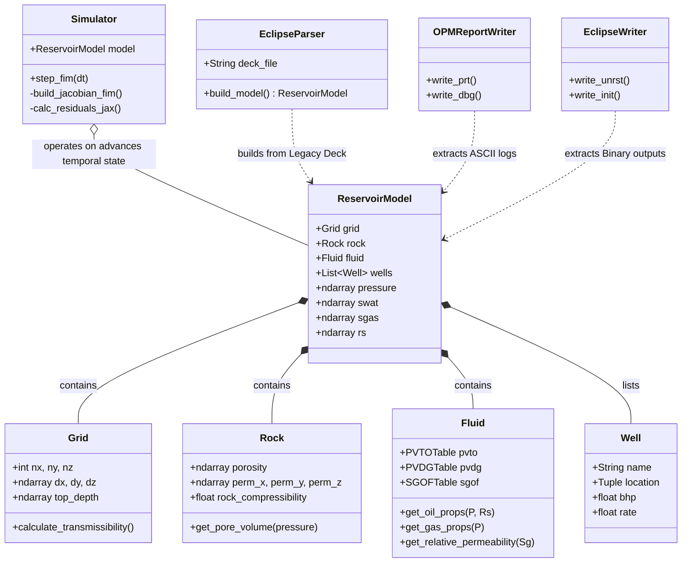

# Engineering Philosophy & Class Architecture

The architecture of this Python reservoir simulator is fundamentally driven by classical Reservoir Engineering and Petrophysics philosophies. Rather than viewing the simulator as a purely abstract mathematical matrix-solving engine, the Object-Oriented Programming (OOP) design strictly compartmentalizes real-world physical phenomena into distinct, isolated class entities.

## 1. Defining the Domain: Philosophical Mapping

### Petrophysics & Structural Geology (`Grid` & `Rock`)
In reality, the geological framework exists independently of the transient fluids that inhabit it. 
*   **`Grid`**: Represents the spatial boundaries, structural faults, and geometric stratigraphy of the earth model. It isolates solely the "empty container" (Control Volumes $V_b$, Area $A$, Depth $Z$).
*   **`Rock`**: Encapsulates static petrophysical rock-typing like Porosity ($\phi$) and Absolute Permeability ($K$). It also governs geomechanics, specifically volumetric rock-elasticity (Pore Volume compressibility $c_r$) mapped linearly under varying stress loads.

### Thermodynamics & PVT Equivalents (`Fluid`)
Fluids in a reservoir shift their volumetric and flow behaviors based completely on strictly bounded thermodynamic conditions ($P, V, T$).
*   **`Fluid`**: Acts as the PVT engine tracking Equations of State. It isolates all Black-Oil phase property changes tracking saturated vs. undersaturated phase transitions limitlessly, calculating Expansion ($B_o, B_g$), Viscous flow friction ($\mu_o, \mu_g$), and Relative Permeability hysteresis ($k_{ro}, k_{rg}$) completely independently of the structural geological grid.

### Transient State Snapshot (`ReservoirModel`)
*   **`ReservoirModel`**: Represents the exact "Snapshot" of the reservoir at an instantaneous slice of time $t$. It holds the dynamic spatial distribution variables natively (Pressures $P$, Phase Saturations $S_w/S_g$, and Bubble-Point metrics $R_s$), functionally uniting the static `Grid`, `Rock`, and `Fluid` rules into a singular quantifiable physical instant.

### Boundary Conditions & Human Intervention (`Well`)
*   **`Well`**: Formulates human intervention. Wells act mathematically as Dirac delta source/sink terms injected into the PDEs. Their physical logic is bound by field operational constraints strictly driven by surface-level flow targets (`ORAT/GRAT`) or subsurface pressure floors (`BHP`).

### Mathematical Temporal Execution (`Simulator`)
*   **`Simulator`**: The temporal operator. It does not natively "store" internal physical properties; rather, its only role is tracking the Newtonian mathematical matrix mappings, structurally applying the laws of strictly quantified mass-conservation algorithms utilizing the Fully Implicit Method (FIM). It exists exclusively to advance the `ReservoirModel` sequentially from time $t$ to $t + \Delta t$.

## 2. Class Structure Diagram

The following Mermaid diagram outlines the strict structural decoupling enforced identically across the Python simulation workflow. `ReservoirModel` acts as the aggregate interface structurally passing static states physically to the `Simulator` core.

