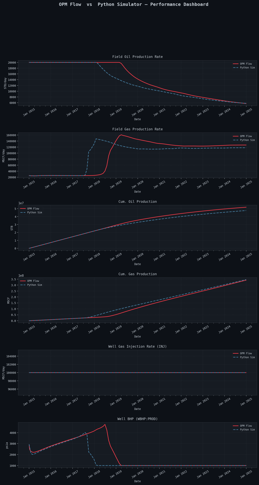
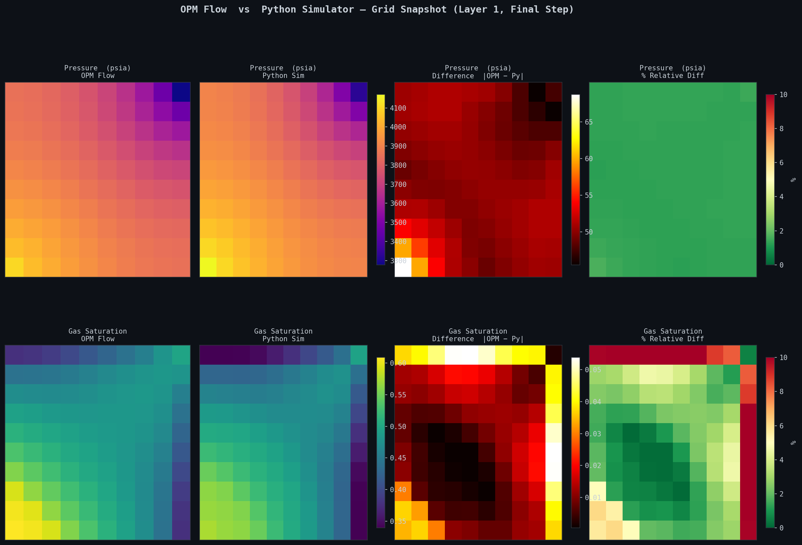
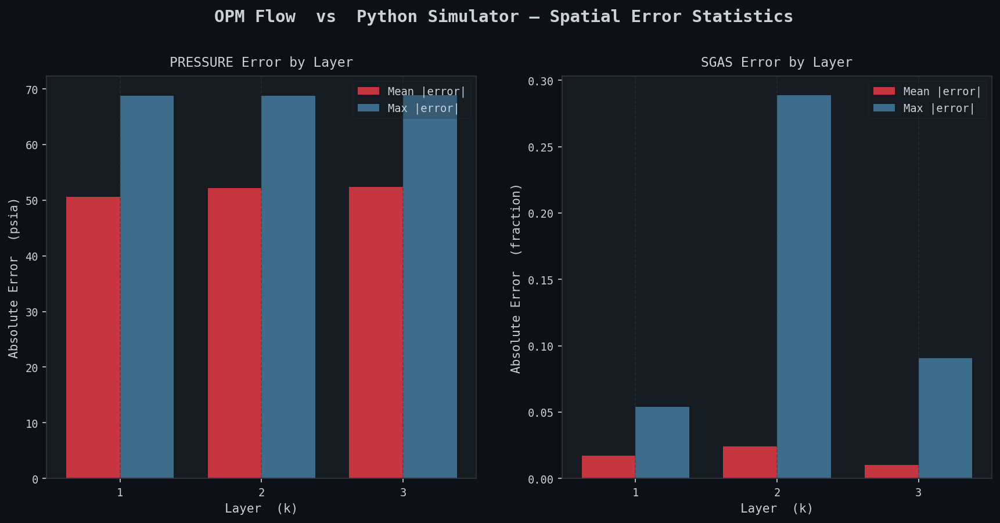

# Testing Summary - SPE1 Parity Dashboard

This document summarizes the results of the reservoir simulation parity project. It tracks the gap between the Python reservoir simulator and the OPM Flow benchmark.

## Parity Overview: The Breakthrough Gap

A key finding in our testing is the discrepancy in gas breakthrough timing and production rate decline.

### Breakthrough Trigger Event (BHP Limit)

Both simulators experience a decline in Field Oil Production Rate (FOPR) when the production well hits its **minimum BHP constraint of 1000 psia**. However, this occurs at different times:

| Simulator | Decline Starts | Trigger Event | Mechanism |
| :--- | :--- | :--- | :--- |
| **Python** | **Feb 2018** | **BHP Limit Hit** | Reservoir pressure dropped earlier due to faster gas arrival. |
| **OPM Flow** | **Mar 2019** | **BHP Limit Hit** | Same mechanism, but delayed by 13 months. |

### Technical Analysis of the Timing Gap

*   **Earlier Breakthrough**: By Jan 2018, Python's FGOR is **7.38**, while OPM is still at **1.33**.
*   **Productivity Loss**: Earlier gas arrival in Python increases gas saturation ($S_g$), reducing oil relative permeability ($k_{ro}$). This forces the well to hit the 1000 psi BHP floor sooner to maintain the target rate.
*   **Recent Fixes**:
    - **Gravity Fix**: Corrected X-direction gas potential calculation (previously used oil gradient incorrectly).
    - **Saturation TVD**: Implemented saturation-centric TVD flux limiters to sharpen the gas front and reduce numerical smearing.

---

## Comparison Dashboard

The following figures illustrate the latest parity match using the **Saturation-Centric TVD** scheme and refined **1/Bg interpolation**.

### 1. Production Time Series

> [!NOTE]
> Observe the sharper FOPR decline profile in the Python results after the recent TVD implementation.

### 2. Grid Snapshot (Final Step)

> [!TIP]
> This plot compares the spatial distribution of pressure and gas saturation at the end of 10 years.

### 3. Error Statistics


---

## Project Structure (Regularized)

The testing environment has been standardized to ensure reproducible benchmarking:

```text
tests/
├── run/       # Active simulator outputs per scenario
│   └── spe1/
├── ref/       # Golden Reference results per scenario
│   └── spe1/
└── reports/   # Documentation and dashboards per scenario
    └── spe1/
        └── figures/
```

> [!IMPORTANT]
> To regenerate these reports, use the "Compare: SPE1" configuration in VS Code, or:
> `.venv/bin/python3 tools/compare_results.py --py-dir tests/run/spe1/ --opm-dir tests/ref/spe1/ --output-dir tests/reports/spe1/figures/`
